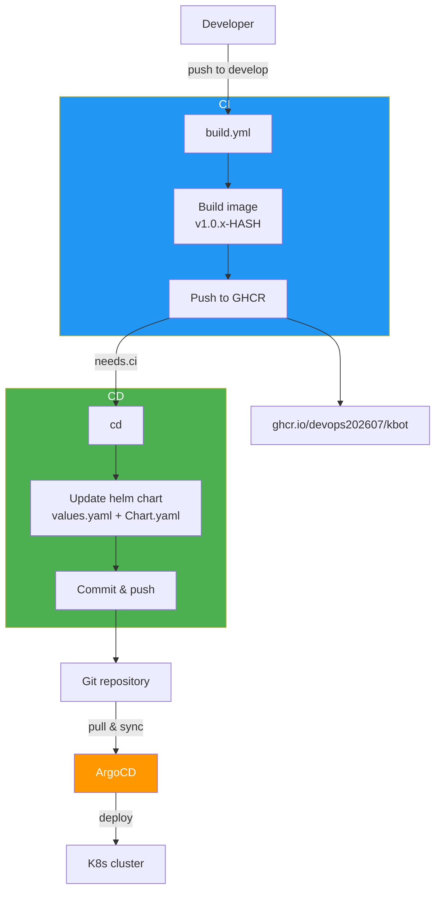

# kbot

Telegram-bot

[Cobra](https://github.com/spf13/cobra)

[telebot](https://gopkg.in/telebot.v3)

**Bot link:** <https://t.me/dmytrozaiets_kbot>

## CI/CD Workflow



## Build

```bash
git clone https://github.com/devops202607/kbot.git
cd kbot
make linux
```

## Usage

```bash
export TELE_TOKEN="your-telegram-bot-token"
./kbot start
```

### CLI commands

`kbot start` - start bot

`kbot version` - show version

### Command for bot in Telegram

`hello` - say Hello, show version

Example:
```
User: hello
KBot: Hello, I'm KBot v1.0.3!
```
